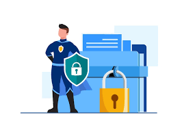

# Task 1: Landing Page - SecureNet

## Overview
This is a fully responsive landing page designed for "SecureNet", a fictional internet security service. The page showcases the brand, its features, benefits, and call-to-action sections, following modern UI principles.

## Features
- Responsive layout using Flexbox and media queries
- Hero section with call-to-action button
- Two-column feature sections with illustrations
- Feature grid highlighting key benefits
- Stats section with global reach data
- Clean footer with contact and social icons

## Technologies Used
- HTML5
- CSS3 (Flexbox, Grid, Media Queries)
- No JavaScript or frameworks used

## Folder Structure
Task 1 - Landing Page/
├── index.html
├── style.css
├── README.md

## How to Run
1. Clone this repository or download the folder.
2. Open `index.html` in any modern web browser.

## Screenshots (Images)
1.[Landing Page Screenshot](screenshot.png)

